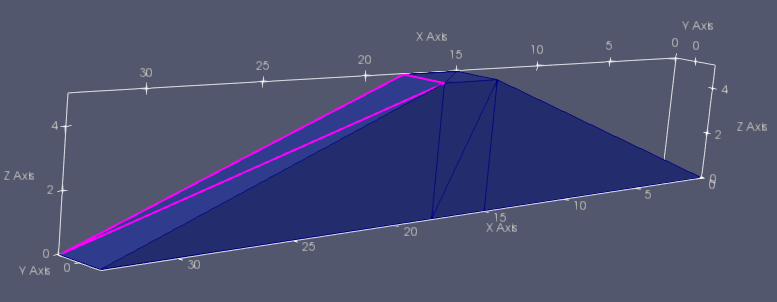

# Analysis-of-Water-Control-Structures-on-Cluster
For the SC18 poster and CAINE18 paper Flexible Architecture for Analysis of Water Control Structures.

# Extensible OpenFOAM framework for cluster(Beocat)

This is a handy framework for user to run OpenFOAM application on cluster like Beocat.



## Dependency


## Installation

OS X & Linux:

 

## Usage example

A few motivating and useful examples of how your product can be used. Spice this up with code blocks and potentially more screenshots.


 
## Development setup

Describe how to install all development dependencies and how to run an automated test-suite of some kind. Potentially do this for multiple platforms.

```sh
make install
npm test
```

## Release History

* 0.0.1
    * Add HPC job submission code.

## Lincese

See the LICENSE file.
 

 
 

 